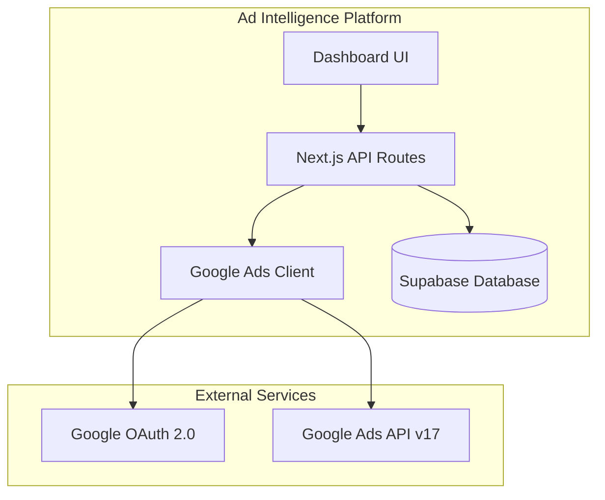
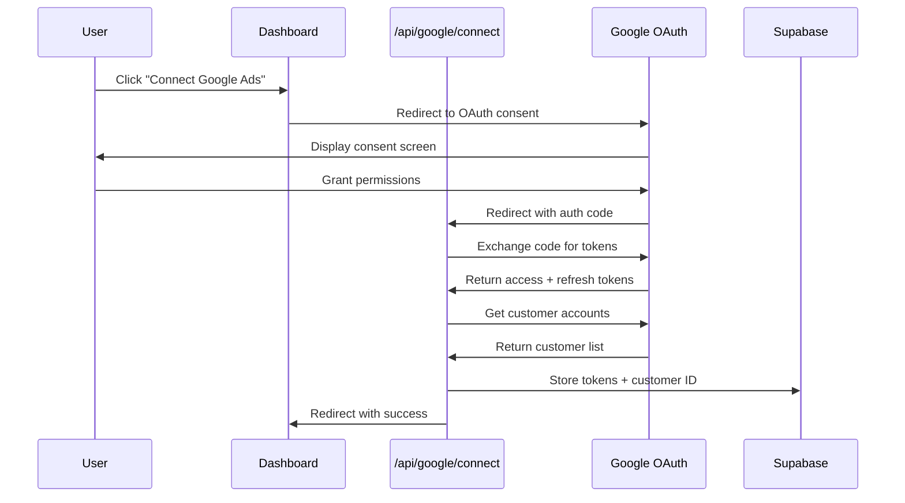
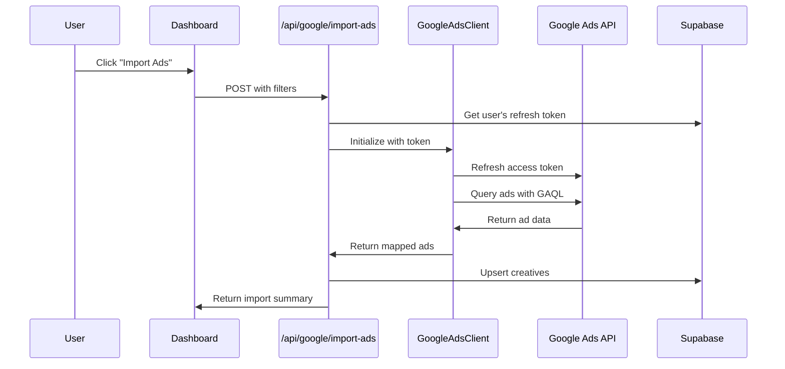

# Design Document

## Overview

This document outlines the technical design for replacing Meta Ads integration with Google Ads integration in the Ad Intelligence platform. The implementation will follow the existing architectural patterns established by the Meta integration while adapting to Google Ads API specifics.

The integration consists of three main components:
1. **Google Ads API Client** - Handles authentication and API communication
2. **API Routes** - Next.js API endpoints for OAuth callback and ad import
3. **Database Schema Updates** - Migration to replace Meta fields with Google fields

## Architecture

### System Context



### Authentication Flow



### Ad Import Flow



## Components and Interfaces

### 1. Google Ads Client (`/lib/google/client.ts`)

```typescript
interface GoogleAdsClientConfig {
  clientId: string;
  clientSecret: string;
  developerToken: string;
  refreshToken: string;
}

interface GoogleCustomerAccount {
  customerId: string;
  descriptiveName: string;
  currencyCode: string;
  timeZone: string;
}

interface GoogleAdData {
  id: string;
  name: string;
  campaignId: string;
  campaignName: string;
  adGroupId: string;
  adGroupName: string;
  status: string;
  type: string;
  finalUrls: string[];
  displayUrl: string;
  headlines: string[];
  descriptions: string[];
  metrics: GoogleAdMetrics;
}

interface GoogleAdMetrics {
  impressions: number;
  clicks: number;
  cost: number; // in micros (divide by 1,000,000)
  conversions: number;
  ctr: number;
  averageCpc: number; // in micros
}

class GoogleAdsClient {
  private config: GoogleAdsClientConfig;
  private accessToken: string | null;
  private customerId: string;

  constructor(config: GoogleAdsClientConfig, customerId: string);

  // Token management
  async refreshAccessToken(): Promise<string>;

  // Account operations
  async getAccessibleCustomers(): Promise<GoogleCustomerAccount[]>;
  async getCustomerInfo(customerId: string): Promise<GoogleCustomerAccount>;

  // Ad retrieval
  async getAds(options?: GetAdsOptions): Promise<GoogleAdData[]>;
  async getAdById(adId: string): Promise<GoogleAdData>;

  // Private helpers
  private async executeGaqlQuery(query: string): Promise<any>;
  private mapResponseToAdData(response: any): GoogleAdData[];
}

interface GetAdsOptions {
  campaignStatus?: 'ENABLED' | 'PAUSED' | 'REMOVED' | 'ALL';
  dateRangeStart?: string; // YYYY-MM-DD
  dateRangeEnd?: string;
  limit?: number;
}
```

### 2. OAuth Connect Route (`/app/api/google/connect/route.ts`)

```typescript
// GET handler for OAuth callback
export async function GET(request: NextRequest): Promise<NextResponse> {
  // 1. Extract authorization code from query params
  // 2. Exchange code for tokens via Google OAuth
  // 3. Fetch accessible customer accounts
  // 4. Store refresh token and default customer ID in database
  // 5. Redirect to dashboard with success/error status
}

// Helper functions
async function exchangeCodeForTokens(code: string): Promise<TokenResponse>;
async function getAccessibleCustomers(accessToken: string): Promise<CustomerAccount[]>;
async function storeGoogleCredentials(userId: string, credentials: GoogleCredentials): Promise<void>;
```

### 3. Import Ads Route (`/app/api/google/import-ads/route.ts`)

```typescript
interface ImportAdsRequest {
  dateRangeStart?: string;
  dateRangeEnd?: string;
  campaignStatus?: string;
}

interface ImportAdsResponse {
  success: boolean;
  totalAds: number;
  importedAds: number;
  updatedAds: number;
  skippedAds: number;
  errors: string[];
}

// POST handler for ad import
export async function POST(request: NextRequest): Promise<NextResponse> {
  // 1. Authenticate user via Supabase
  // 2. Get user's Google credentials from database
  // 3. Initialize GoogleAdsClient
  // 4. Fetch ads with filters
  // 5. Map to creatives schema
  // 6. Upsert to database
  // 7. Return import summary
}

// Helper functions
function mapGoogleAdToCreative(ad: GoogleAdData, userId: string): Creative;
function buildPerformanceJson(metrics: GoogleAdMetrics): PerformanceMetrics;
```

### 4. Type Definitions (`/lib/types.ts` additions)

```typescript
// Add to existing types file
export interface GoogleCredentials {
  refreshToken: string;
  accessToken?: string;
  tokenExpiresAt?: Date;
  customerId: string;
  accountName?: string;
}

export interface GoogleTokenResponse {
  access_token: string;
  refresh_token?: string;
  expires_in: number;
  token_type: string;
  scope: string;
}
```

### 5. Constants (`/lib/constants.ts` additions)

```typescript
export const GOOGLE_CONFIG = {
  API_VERSION: 'v17',
  OAUTH_ENDPOINT: 'https://accounts.google.com/o/oauth2/v2/auth',
  TOKEN_ENDPOINT: 'https://oauth2.googleapis.com/token',
  ADS_API_ENDPOINT: 'https://googleads.googleapis.com',
  SCOPES: ['https://www.googleapis.com/auth/adwords'],
  REDIRECT_URI: process.env.NEXT_PUBLIC_APP_URL + '/api/google/connect',
};

export const API_ROUTES = {
  // Update existing routes
  GOOGLE_CONNECT: '/api/google/connect',
  GOOGLE_IMPORT_ADS: '/api/google/import-ads',
  GOOGLE_DISCONNECT: '/api/google/disconnect',
  // ... keep existing non-Meta routes
};
```

## Data Models

### Database Schema Changes

```sql
-- Migration: Replace Meta fields with Google fields in users table

-- Add Google Ads columns
ALTER TABLE users
ADD COLUMN google_refresh_token TEXT,
ADD COLUMN google_access_token TEXT,
ADD COLUMN google_token_expires_at TIMESTAMPTZ,
ADD COLUMN google_customer_id TEXT,
ADD COLUMN google_account_name TEXT;

-- Remove Meta columns (after confirming no active Meta users)
ALTER TABLE users
DROP COLUMN IF EXISTS meta_access_token,
DROP COLUMN IF EXISTS meta_token_expires_at,
DROP COLUMN IF EXISTS meta_ad_account_id;

-- Add index for customer ID lookups
CREATE INDEX idx_users_google_customer_id ON users(google_customer_id);
```

### Creatives Table Mapping

The existing `creatives` table will be reused with the following field mappings:

| Creatives Field | Google Ads Source | Transformation |
|-----------------|-------------------|----------------|
| `ad_id` | `ad.id` | Direct mapping |
| `brand_name` | `campaign.name` | Use campaign name |
| `ad_copy` | `ad.headlines` + `ad.descriptions` | Concatenate with newlines |
| `cta` | `ad.finalUrls[0]` | First final URL |
| `ad_image_url` | N/A (text ads) | Leave null for responsive search ads |
| `source_type` | - | Always 'own' |
| `performance` | `metrics.*` | Map to JSON structure |

### Performance Metrics Mapping

```typescript
// Google Ads metrics to creatives.performance mapping
{
  impressions: metrics.impressions,
  clicks: metrics.clicks,
  ctr: metrics.ctr * 100, // Convert to percentage
  cpc: metrics.averageCpc / 1000000, // Convert from micros
  spend: metrics.cost / 1000000, // Convert from micros
  conversions: metrics.conversions,
}
```

## Error Handling

### Error Categories and Responses

| Error Type | HTTP Status | User Message | Action |
|------------|-------------|--------------|--------|
| Invalid OAuth code | 400 | "Authorization failed. Please try again." | Redirect to dashboard with error |
| Token refresh failed | 401 | "Your Google Ads connection expired. Please reconnect." | Clear tokens, prompt reconnect |
| Rate limit exceeded | 429 | "Too many requests. Please wait a moment." | Implement exponential backoff |
| Permission denied | 403 | "Missing permissions. Please reconnect with required access." | Show required scopes |
| Invalid customer ID | 400 | "Selected account not found. Please choose another." | Show account selector |
| API unavailable | 503 | "Google Ads is temporarily unavailable. Please try later." | Log error, show retry option |

### Retry Strategy

```typescript
const RETRY_CONFIG = {
  maxRetries: 3,
  initialDelayMs: 1000,
  maxDelayMs: 10000,
  backoffMultiplier: 2,
};

async function withRetry<T>(
  operation: () => Promise<T>,
  config = RETRY_CONFIG
): Promise<T> {
  let lastError: Error;
  let delay = config.initialDelayMs;

  for (let attempt = 0; attempt <= config.maxRetries; attempt++) {
    try {
      return await operation();
    } catch (error) {
      lastError = error;
      if (!isRetryableError(error) || attempt === config.maxRetries) {
        throw error;
      }
      await sleep(delay);
      delay = Math.min(delay * config.backoffMultiplier, config.maxDelayMs);
    }
  }
  throw lastError;
}

function isRetryableError(error: any): boolean {
  const retryableCodes = [429, 500, 502, 503, 504];
  return retryableCodes.includes(error.status);
}
```

### Logging

All API errors will be logged with:
- Timestamp
- User ID (anonymized)
- Error code and message
- Request context (endpoint, parameters)
- Stack trace (development only)

## Testing Strategy

### Unit Tests

**Google Ads Client (`/tests/unit/google/client.test.ts`)**
- Token refresh success/failure
- GAQL query construction
- Response mapping to GoogleAdData
- Error handling for various API responses
- Metrics conversion (micros to standard units)

**API Route Handlers**
- OAuth code exchange
- Token storage and retrieval
- Ad import with various filters
- Error response formatting

### Integration Tests

**OAuth Flow (`/tests/integration/api/google-connect.test.ts`)**
- Complete OAuth callback flow (mocked Google responses)
- Token storage verification
- Multi-account handling
- Error scenarios (invalid code, expired token)

**Ad Import (`/tests/integration/api/google-import-ads.test.ts`)**
- Full import flow with mocked API
- Database upsert verification
- Filter application
- Partial failure handling

### E2E Tests

**Connection Flow**
- Navigate to dashboard → Click connect → Complete OAuth → Verify connected state
- Disconnect and reconnect flow

**Import Flow**
- Connect account → Import ads → Verify ads appear in dashboard
- Apply filters → Verify filtered results

### Test Data

Mock Google Ads API responses will be created in `/tests/fixtures/google/`:
- `customers.json` - Sample customer account list
- `ads.json` - Sample ad responses with various types
- `metrics.json` - Sample performance metrics
- `errors.json` - Various error responses

### Environment Setup

Test environment variables:
```
GOOGLE_ADS_CLIENT_ID=test-client-id
GOOGLE_ADS_CLIENT_SECRET=test-client-secret
GOOGLE_ADS_DEVELOPER_TOKEN=test-developer-token
GOOGLE_TEST_REFRESH_TOKEN=test-refresh-token
GOOGLE_TEST_CUSTOMER_ID=1234567890
```

## Security Considerations

### Token Storage
- Refresh tokens stored encrypted using Supabase's built-in encryption
- Access tokens stored temporarily (1-hour expiry)
- Tokens never logged or exposed in error messages

### API Security
- All routes protected by Supabase Auth middleware
- RLS policies ensure users can only access their own data
- Rate limiting on import endpoint (10 requests/minute)

### OAuth Security
- State parameter used to prevent CSRF attacks
- PKCE flow recommended for additional security
- Strict redirect URI validation

## Migration Plan

### Phase 1: Add Google Integration (Non-breaking)
1. Add Google columns to users table
2. Deploy Google client and API routes
3. Add Google connect button to dashboard (alongside Meta)

### Phase 2: Deprecate Meta (Soft removal)
1. Hide Meta connect button for new users
2. Show migration prompt for existing Meta users
3. Keep Meta functionality working

### Phase 3: Remove Meta (Hard removal)
1. Remove Meta columns from database
2. Delete Meta client and API routes
3. Update all UI to Google-only

## Environment Variables

Required new environment variables:
```
GOOGLE_ADS_CLIENT_ID=your-client-id
GOOGLE_ADS_CLIENT_SECRET=your-client-secret
GOOGLE_ADS_DEVELOPER_TOKEN=your-developer-token
NEXT_PUBLIC_GOOGLE_ADS_ENABLED=true
```

Variables to remove (Phase 3):
```
META_APP_ID
META_APP_SECRET
META_ACCESS_TOKEN
```

## Dependencies

New npm packages required:
```json
{
  "google-auth-library": "^9.0.0",
  "google-ads-api": "^14.0.0"
}
```

Alternative: Direct REST API calls without SDK (reduces bundle size but more code).

## File Structure

```
lib/
  google/
    client.ts          # GoogleAdsClient class
    types.ts           # Google-specific type definitions
    utils.ts           # Helper functions (GAQL builders, etc.)

app/
  api/
    google/
      connect/
        route.ts       # OAuth callback handler
      import-ads/
        route.ts       # Ad import handler
      disconnect/
        route.ts       # Disconnect account handler

tests/
  unit/
    google/
      client.test.ts
  integration/
    api/
      google-connect.test.ts
      google-import-ads.test.ts
  fixtures/
    google/
      customers.json
      ads.json
      metrics.json
```
